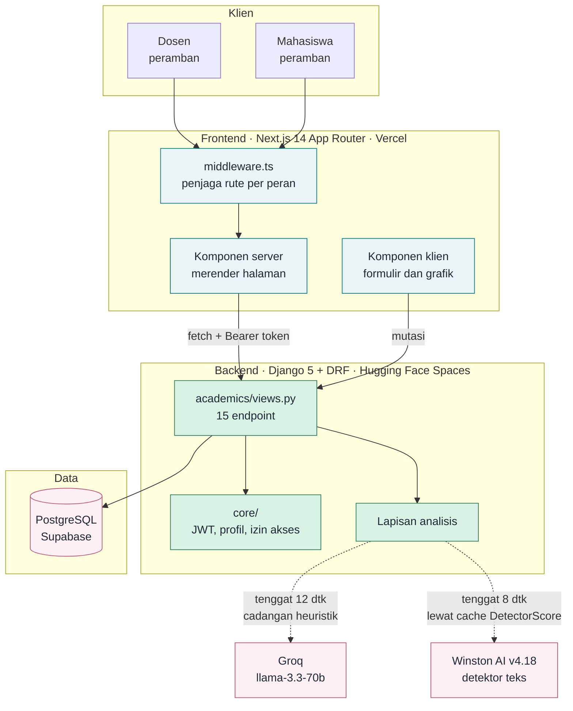
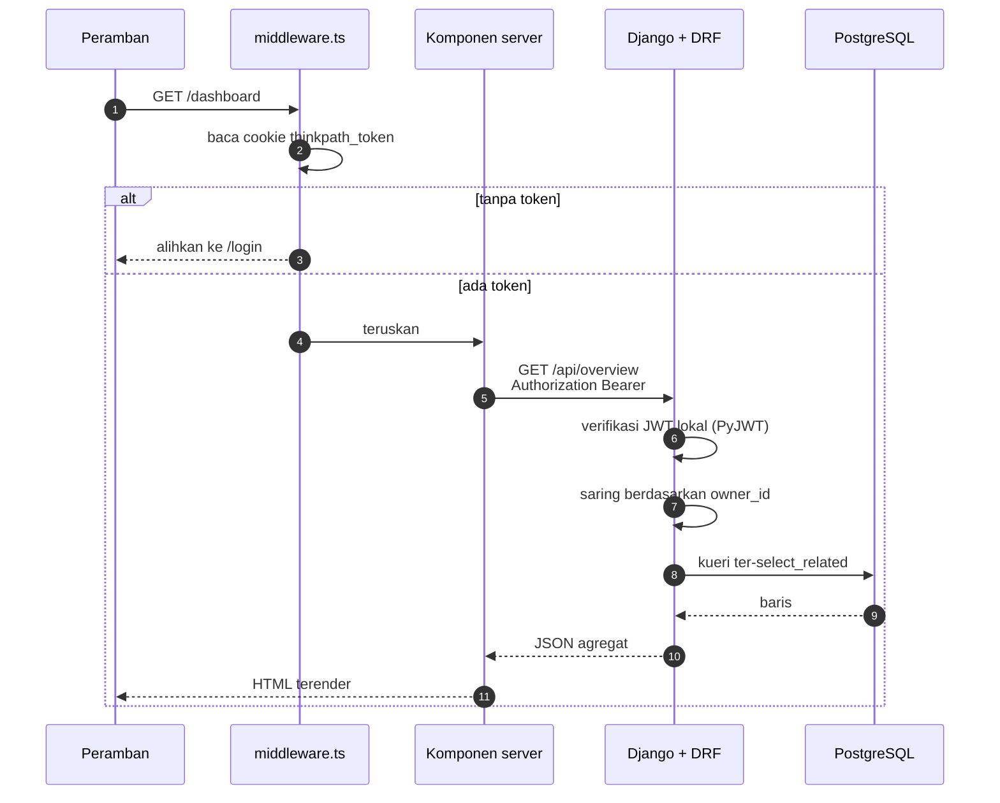
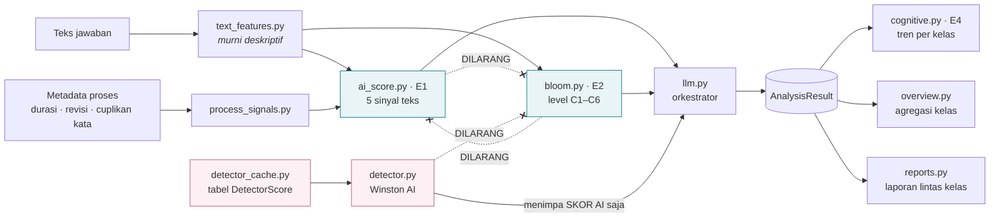
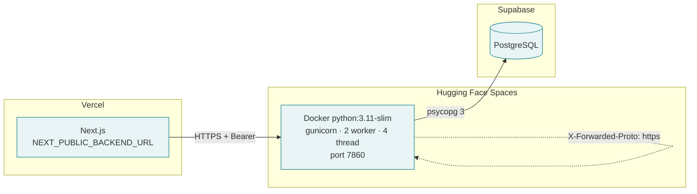

# 01 · Arsitektur Sistem

Diagram di berkas ini menggambarkan susunan sistem, bukan alur pemakaian. Untuk
alur per peran lihat [02](./02-alur-dosen.md), [03](./03-alur-mahasiswa.md), dan
[04](./04-interaksi-gabungan.md).

---

## 1.1 Peta lapisan

Pola yang dipakai adalah **satu pintu API**. Frontend tidak pernah menyentuh
basis data secara langsung; seluruh kueri, autentikasi, dan logika bisnis
terpusat di Django.

**Kenapa satu pintu.** Kepemilikan data dan izin akses hanya perlu dijaga di
satu tempat. Setiap endpoint menyaring berdasarkan pemilik lewat helper
`_require_owned_*`, dan tidak ada jalur kedua yang bisa melewatinya.

---

## 1.2 Perjalanan satu permintaan

Verifikasi token terjadi **di proses yang sama**, tanpa panggilan ke layanan
pihak ketiga. Dua layanan luar yang dipakai, Groq dan Winston, keduanya hanya
disentuh saat menganalisis tugas, dan keduanya punya jalur cadangan. Tidak ada
satu pun permintaan halaman yang bergantung pada layanan luar.

Keduanya dipanggil **berurutan**, bukan bersamaan: 8 detik untuk Winston lalu 12
detik untuk Groq, sehingga kasus terburuknya 20 detik. Angka itu sengaja ditahan
jauh di bawah tenggat gunicorn 60 detik supaya worker tidak pernah dibunuh tepat
saat salah satu API hendak menjawab.

---

## 1.3 Lapisan analisis

Tiga panah putus-putus itu **dijaga uji otomatis** yang membaca kode lewat AST,
bukan pencocokan teks. Menambahkan `import` terlarang akan langsung
menggagalkan tes, sehingga pemisahan ini tidak bisa runtuh tanpa disadari.

Alasannya: level kognitif dan dugaan penggunaan AI adalah dua hal berbeda.
Mahasiswa bisa menulis analisis tajam dengan bantuan AI, dan bisa juga menulis
jawaban lemah sepenuhnya sendiri.

Detektor eksternal masuk sebagai **penimpa di atas hasil yang sudah jadi**, bukan
cabang di tengah alur. Karena skor Bloom sudah selesai dihitung sebelum detektor
dipanggil, tidak ada jalur kode yang bisa membawa skor detektor ke sana. Bentuk
itu membuat pemisahannya berdiri sendiri, bukan bergantung pada kedisiplinan
siapa pun yang menyunting berkas ini nanti.

---

## 1.4 Susunan penempatan

**Jebakan saat menempatkan.** HF butuh URL Vercel untuk `CORS_ALLOWED_ORIGINS`,
sedangkan Vercel butuh URL HF untuk `NEXT_PUBLIC_BACKEND_URL`. Melingkar. Urutan
yang bekerja: tempatkan backend lebih dulu dengan CORS sementara, tempatkan
frontend, lalu kembali membetulkan CORS di HF.

`DJANGO_ALLOWED_HOSTS` wajib diisi nama Space. Kalau tetap `localhost`, seluruh
permintaan ditolak `400` dengan penyebab yang sulit ditebak.
