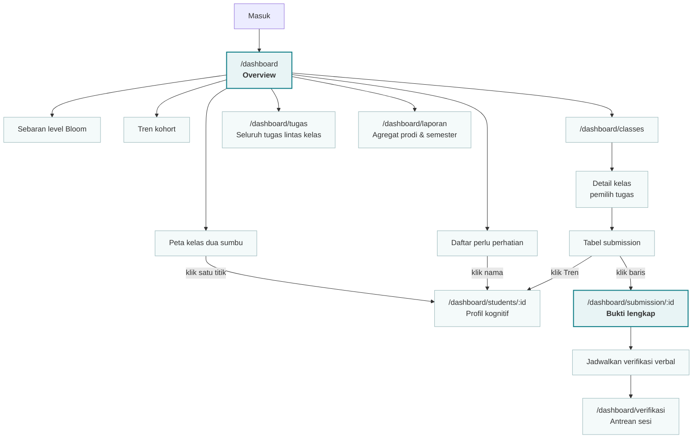
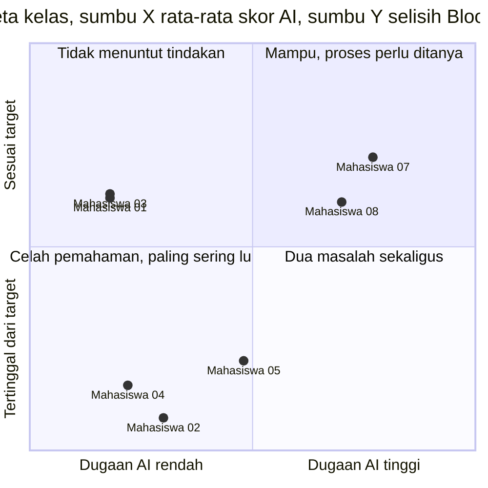
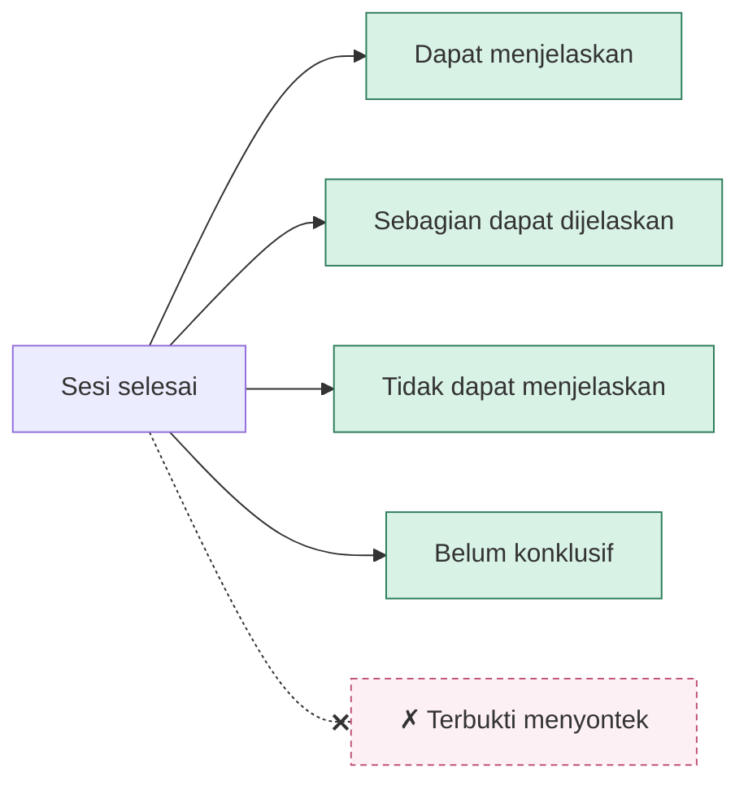
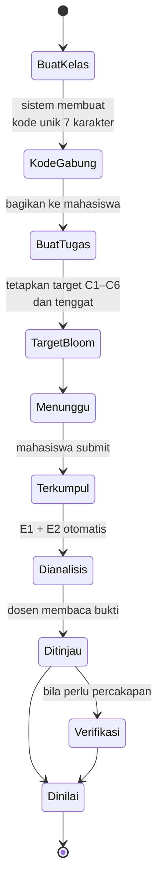

# 02 · Interaksi Sistem dengan Dosen

Seluruh alur di sini bertumpu pada satu prinsip: sistem menyodorkan **bukti**,
keputusan tetap di tangan dosen.

---

## 2.1 Peta perjalanan dosen

---

## 2.2 Membaca peta kelas

Peta memakai **dua sumbu, bukan peringkat**. Peringkat satu sumbu memaksa dosen
membaca kelasnya sebagai antrean tersangka, dan menyembunyikan kuadran yang
paling sering luput.

**Kuadran kiri bawah adalah alasan peta ini ada.** Mahasiswa dengan skor AI
rendah yang tertinggal jauh dari target: jujur, dan tidak tertolong. Alat yang
hanya memberi satu skor kecurigaan tidak akan pernah menunjukkannya.

Pada data demo, himpunan "perlu bantuan" dan himpunan "dicurigai" memang tidak
beririsan sama sekali.

---

## 2.3 Alur meninjau satu submission

```mermaid
sequenceDiagram
    autonumber
    actor DS as Dosen
    participant UI as Halaman submission
    participant API as Backend

    DS->>UI: buka submission
    UI->>API: GET /api/submissions/:id
    API-->>UI: skor, rincian sinyal, jejak proses, teks

    Note over UI: Yang ditampilkan berdampingan
    UI-->>DS: cincin skor AI + band
    UI-->>DS: rincian tiap sinyal, bobot, buktinya
    UI-->>DS: level Bloom + keyakinan sendiri
    UI-->>DS: linimasa & kurva pertumbuhan kata
    UI-->>DS: ritme kalimat pada teks jawaban

    alt Dosen ingin menindaklanjuti
        DS->>UI: jadwalkan verifikasi verbal
        UI->>API: PUT /api/submissions/:id/verification
        Note right of API: status = scheduled<br/>kesimpulan BELUM boleh diisi
        DS->>DS: bicara langsung dengan mahasiswa
        DS->>UI: catat kesimpulan
        UI->>API: PUT status = completed + outcome
        Note right of API: ai_score TIDAK berubah
    else Tidak perlu
        DS->>UI: langsung nilai
        UI->>API: PATCH nilai + umpan balik
    end
```

**Dua penjagaan yang disengaja.** Kesimpulan tidak bisa diisi sebelum status
`completed`, karena membiarkan dosen menyimpulkan saat baru menjadwalkan berarti
menyimpulkan sebelum berbicara. Dan hasil percakapan **tidak pernah** menulis
balik ke `ai_score`: skor yang keliru tidak boleh membenarkan dirinya sendiri
lewat percakapan yang ia picu sendiri.

---

## 2.4 Pilihan kesimpulan verifikasi

Nilai "terbukti menyontek" **sengaja tidak disediakan**. Satu percakapan tidak
menghasilkan kepastian itu, dan menyediakan tombolnya berarti mengundang
kesimpulan yang tidak ditopang bukti apa pun yang dimiliki sistem.

---

## 2.5 Membuat kelas dan tugas

Jenjang, program studi, dan semester melekat pada **kelas**, bukan pada tugas
maupun profil. Tugas mewarisinya dari kelas tempat ia dibuat, sehingga tidak
mungkin ada tugas S2 tersimpan di dalam kelas S1.
