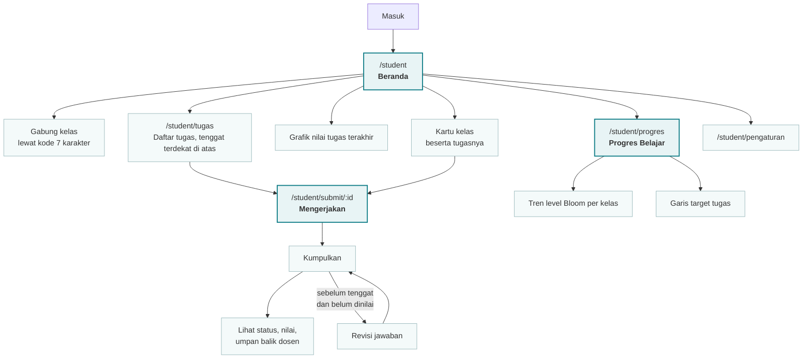
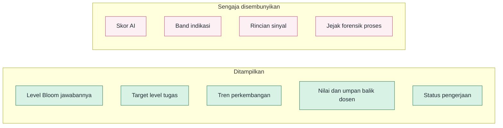
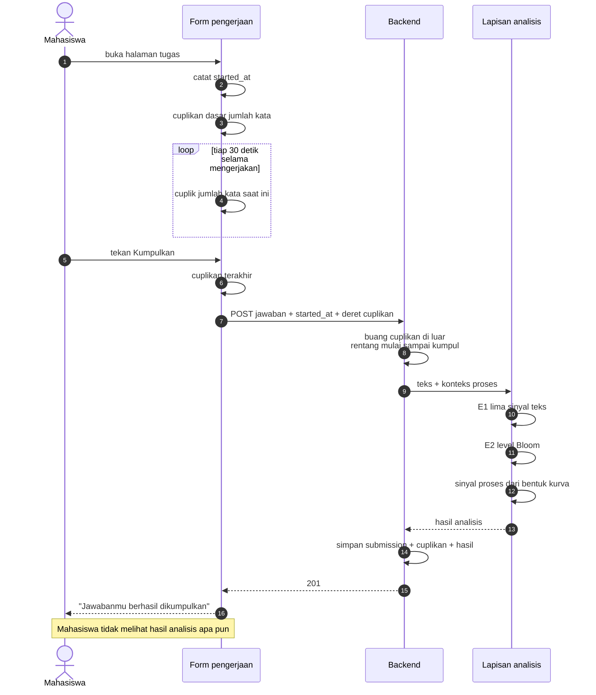
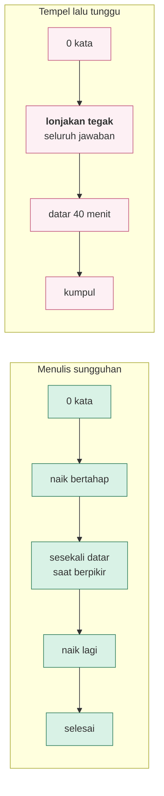
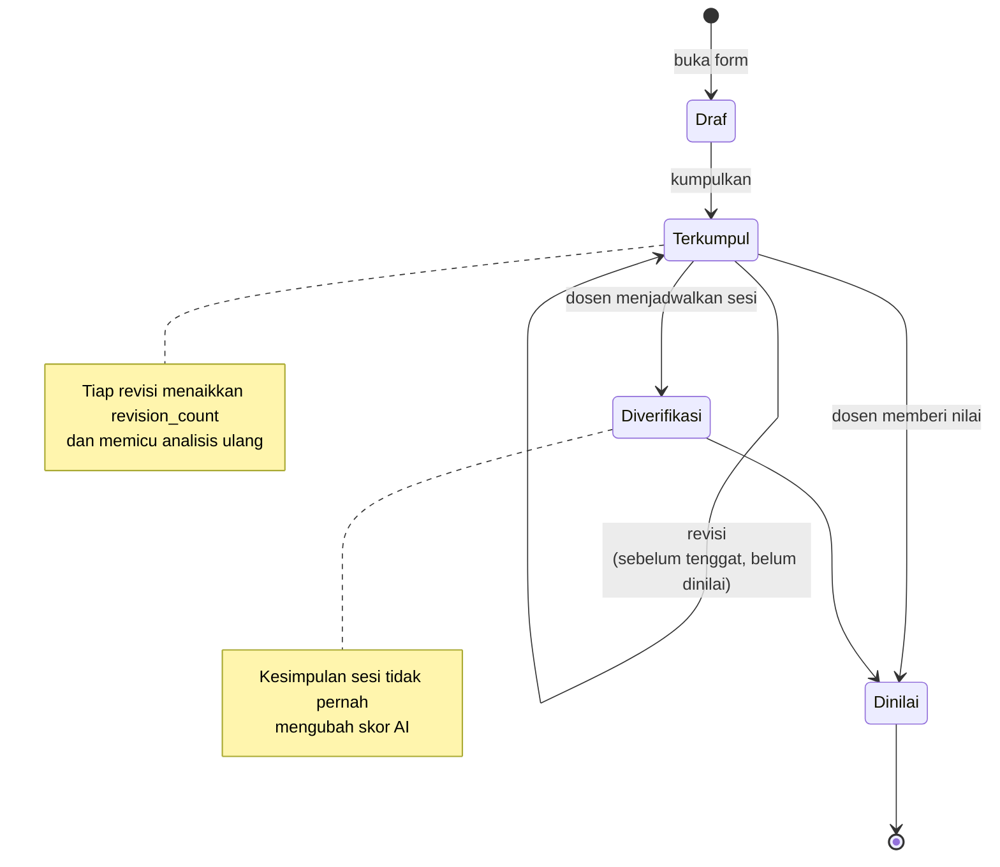

# 03 · Interaksi Sistem dengan Mahasiswa

Aturan yang mengikat seluruh layar di berkas ini: **mahasiswa tidak pernah
melihat dugaan AI tentang dirinya**. Dugaan yang belum diverifikasi tidak pantas
disajikan sebagai penilaian.

---

## 3.1 Peta perjalanan mahasiswa

Tidak ada satu pun simpul di peta ini yang menampilkan skor AI.

---

## 3.2 Apa yang dilihat mahasiswa dan apa yang tidak

Pemisahan ini dijaga di lapisan API, bukan hanya di tampilan.
`StudentSubmissionStatusSerializer` memang tidak memuat `ai_score`, dan endpoint
`/api/student/progress` membuang `ai_band` dari tiap titik sebelum dikirim.
Menyembunyikannya hanya di CSS akan bocor pada permintaan jaringan pertama.

---

## 3.3 Alur mengerjakan tugas, beserta jejak yang terekam

**Cuplikan dasar diambil seketika**, bukan menunggu selang pertama. Tanpa itu,
menempel dalam tiga puluh detik pertama membuat pengamatan perdana sudah memuat
teks penuh, dan jejaknya terbaca datar sejak awal.

Pada mode **revisi** cuplikan tidak dikirim sama sekali, karena kotak sudah
terisi jawaban sebelumnya sehingga cuplikan dasar akan mencatat ratusan kata
sejak detik nol.

---

## 3.4 Bentuk kurva yang membedakan

Menunggu tidak menolong, karena menunggu justru **memperpanjang garis datarnya**.
Diukur pada uji sintetis 400 kata, siasat tempel-lalu-tunggu naik dari 0,30 ke
0,75, dan memecah tempelan jadi empat potong tetap tertangkap di 0,45 karena
seluruh lonjakan dijumlahkan, bukan diambil yang terbesar.

---

## 3.5 Daur hidup satu submission

Setelah tenggat berakhir, pengumpulan ditutup dan revisi tidak lagi mungkin.
Penjagaannya di sisi server, bukan hanya menyembunyikan tombol.
