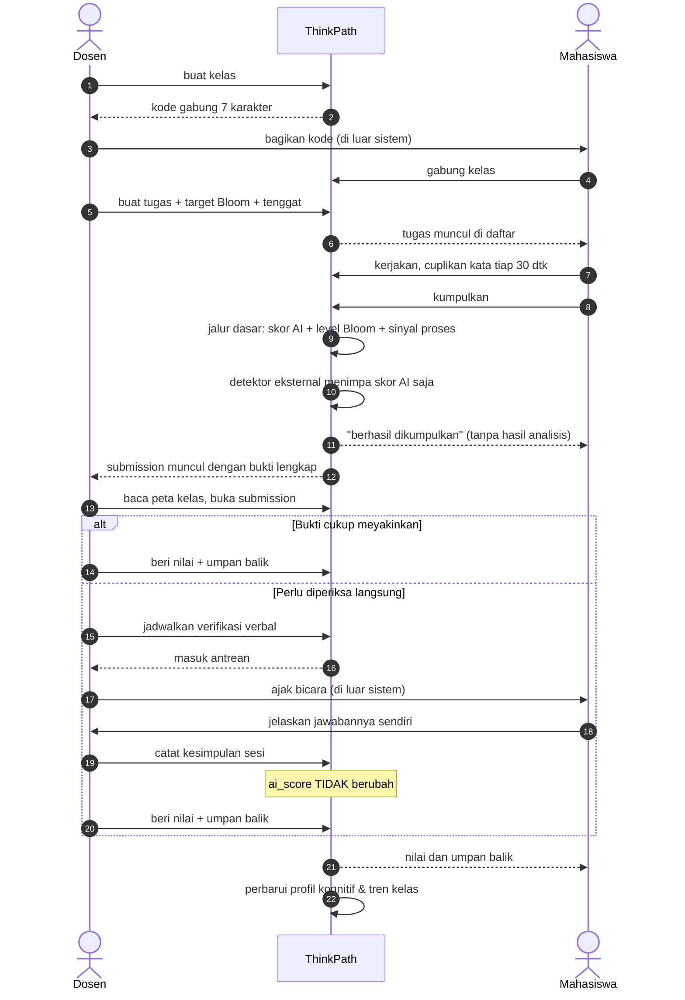
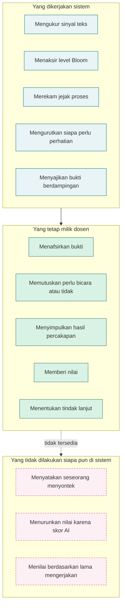
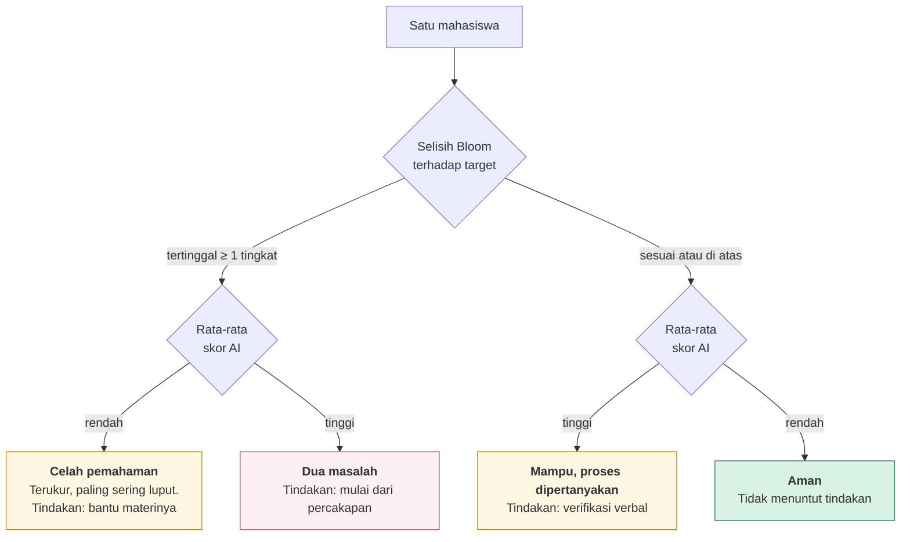
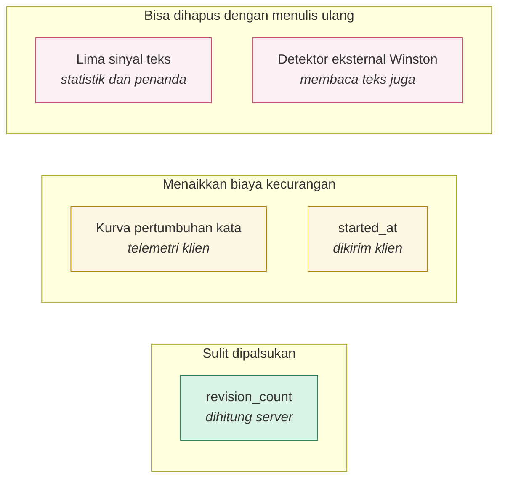
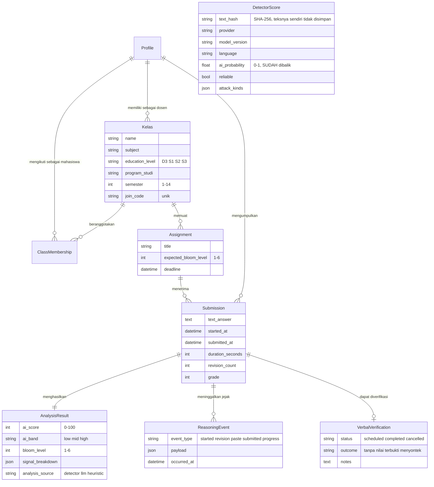

# 04 · Interaksi Dosen, Mahasiswa, dan Sistem

Berkas ini menggambarkan alur yang melibatkan **ketiganya sekaligus**, termasuk
titik tempat sistem sengaja berhenti dan menyerahkan keputusan kepada manusia.

---

## 4.1 Siklus penuh satu tugas

**Perhatikan dua panah yang keluar dari sistem.** Membagikan kode kelas dan
percakapan verifikasi terjadi **di luar** aplikasi. Itu disengaja: ThinkPath
tidak menggantikan percakapan dosen dan mahasiswa, ia hanya memberi tahu
percakapan mana yang paling layak dilakukan lebih dulu.

---

## 4.2 Pembagian wewenang

---

## 4.3 Empat kuadran dan tindak lanjutnya

Peta kelas memisahkan dua pertanyaan yang sering dicampur: *siapa yang mungkin
memakai AI* dan *siapa yang tertinggal*. Keduanya menuntut tindakan berbeda.

Pada data demo, **empat mahasiswa tertinggal dari target dan tidak satu pun di
antaranya pernah berskor AI tinggi.** Kedua himpunan itu tidak beririsan, dan
itulah pembenaran paling langsung untuk memakai dua sumbu.

---

## 4.4 Batas kepercayaan pada tiap masukan

Telemetri sisi klien **tetap bisa dipalsukan** oleh orang yang menyusun
permintaannya sendiri lewat devtools. Yang tertutup adalah kecurangan santai
seperti tempel-lalu-tunggu, dan itu memang mayoritas kasusnya. Menyatakan batas
ini terbuka lebih berguna daripada mengklaim sistem yang tidak bisa diakali.

**Detektor eksternal tidak menaikkan tingkat kepercayaan, ia hanya memperbaiki
tebakan di lapisan terlemah.** Winston dilatih untuk tugas ini dan mengaku
mendukung bahasa Indonesia, jadi tebakannya lebih baik daripada lima sinyal
statistik. Tetapi ia tetap membaca teks, dan apa pun yang membaca teks bisa
dikalahkan parafrase. Itulah sebabnya bobot forensik proses tidak diturunkan
sedikit pun ketika detektor dipasang.

Satu pengecualian yang pantas dicatat: Winston juga melaporkan penyisipan
karakter lebar nol dan penggantian huruf dengan karakter mirip. Berbeda dari
sinyal gaya bahasa, keduanya tidak punya penjelasan polos, karena tidak ada
mahasiswa yang tanpa sengaja menempelkan karakter tak terlihat ke dalam esainya.
Temuan itu ditulis sebagai bukti di layar dosen, bukan ditambahkan diam-diam ke
angkanya.

---

## 4.5 Alur data lintas peran

> Entitas `Class` ditulis **`Kelas`** di diagram karena `Class` adalah kata
> kunci yang direbut parser Mermaid. Nama model Django sebenarnya tetap `Class`.

Jenjang, program studi, dan semester melekat pada **Class**. Bukan pada
`Profile`, karena semester mahasiswa berubah tiap enam bulan sehingga datanya
akan basi terus. Bukan pada `Assignment`, karena duplikasi memungkinkan tugas S2
tersimpan di dalam kelas S1.

`DetectorScore` sengaja **tidak** punya relasi ke `Submission`, dan itu bukan
kelalaian. Kuncinya adalah hash teks, bukan identitas submission, supaya dua
submission dengan teks yang persis sama hanya dibayar sekali ke penyedia yang
menagih per kata. Kalau kuncinya diikat ke submission, tombol Analisis Ulang
pada teks yang tidak berubah akan membayar penuh lagi, dan dosen menekan tombol
itu justru ketika ia ragu pada angkanya.

Teks jawabannya sendiri tidak ikut disalin ke tabel itu, hanya SHA-256 nya.
Jawabannya sudah ada di `Submission.text_answer`, dan menyalinnya ke tabel kedua
hanya menggandakan data pribadi mahasiswa tanpa menambah apa pun.

Provider, versi model, dan bahasa ikut menjadi kunci, bukan sekadar catatan.
Menaikkan versi model otomatis membatalkan seluruh cache lama tanpa ada yang
perlu ingat menghapusnya, karena skor lama berasal dari model yang berbeda.
