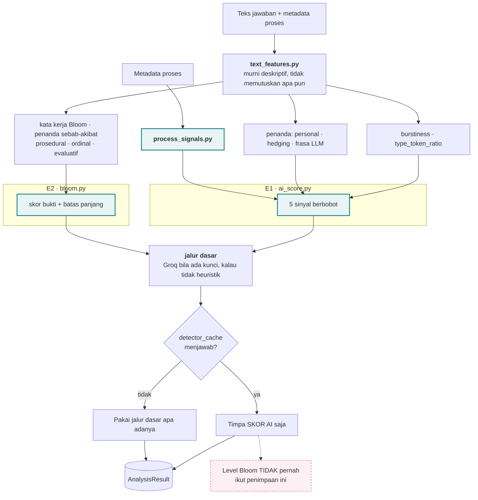
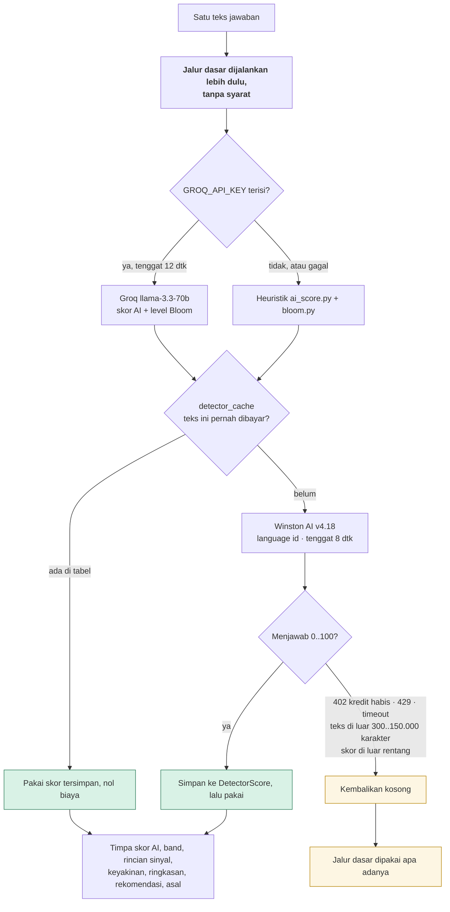
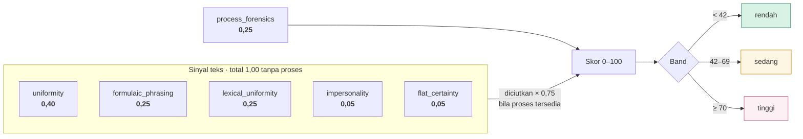
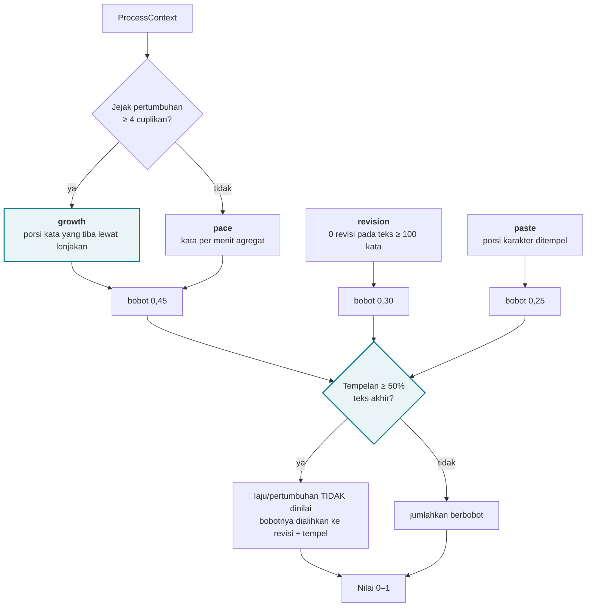
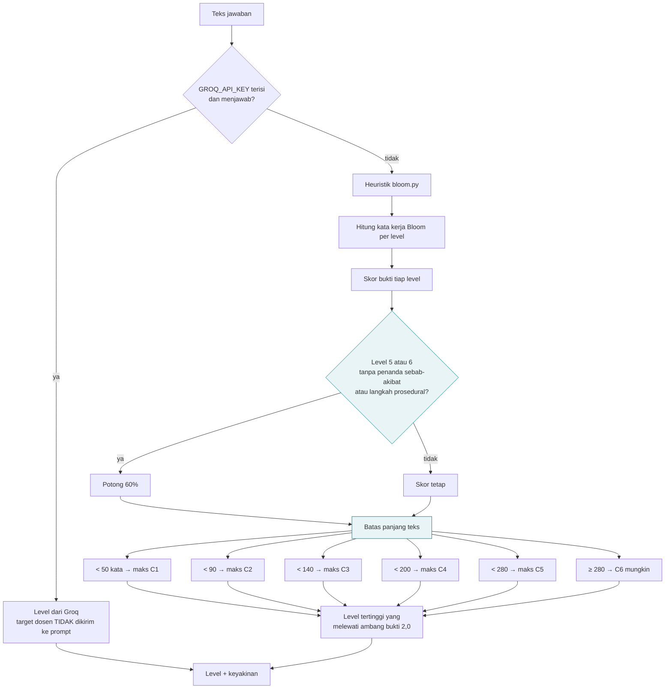
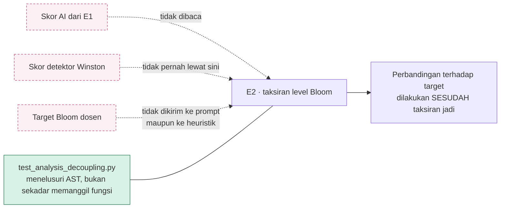
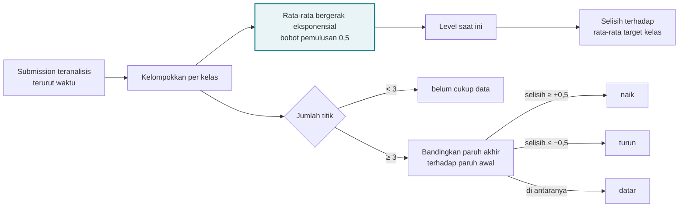

# 05 · Alur Lapisan Analisis

Berkas ini membedah apa yang terjadi antara mahasiswa menekan Kumpulkan dan
dosen melihat angka.

Sesuai kode di `main` setelah PR #11, yang menambahkan detektor eksternal dan
mengganti bobot serta ambang E1 dengan hasil ukur.

---

## 5.1 Pipeline utuh

`text_features.py` sengaja tidak memutuskan apa pun. Ia hanya mengukur properti
teks. Pemisahan itulah yang membuat E1 dan E2 bisa **dibuktikan** saling bebas:
selama keduanya hanya membaca `TextFeatures` dan tidak saling membaca hasil,
ketergantungan melingkar tidak mungkin ada.

Detektor eksternal dipasang sebagai **lapisan penimpa di atas hasil yang sudah
jadi**, bukan sebagai cabang di tengah alur. Bentuk itu dipilih supaya taksiran
Bloom mustahil tercemar secara struktural: tidak ada satu pun jalur kode yang
bisa membawa skor detektor ke sana.

---

## 5.2 Rantai tiga lapis skor AI

**Kenapa kegagalan diratakan jadi kosong.** Tidak satu pun kegagalan detektor
boleh menggagalkan pengumpulan tugas. Mahasiswa yang jawabannya hilang karena
API pihak ketiga sedang mati adalah kerusakan yang jauh lebih besar daripada
satu skor yang tidak terisi.

**Kenapa hanya keberhasilan yang di-cache.** Kredit habis, batas laju, dan
timeout semuanya sementara. Menyimpan "tidak ada hasil" akan membekukan
submission itu di jalur cadangan selamanya, bahkan setelah saldo diisi, dan
tidak akan ada yang menyadarinya karena sistem memang dirancang tenang saat
detektor gagal.

**Kenapa versi model ikut jadi kunci cache.** `MODEL_VERSION` dipaku eksplisit
supaya skor yang tersimpan hari ini masih bisa dijelaskan enam bulan lagi.
Karena versinya ikut di dalam kunci, menaikkannya otomatis membatalkan seluruh
cache lama tanpa ada yang perlu ingat menghapusnya.

Yang perlu diingat: Winston menagih **per kata**, bukan per permintaan. Tanpa
tabel cache, setiap penekanan tombol Analisis Ulang pada teks yang tidak berubah
membayar penuh lagi.

---

## 5.3 E1, lima sinyal dan bobotnya

Sinyal proses diberi porsi terbesar karena ia **satu-satunya yang tidak membaca
teks**. Parafrase, humanizer, dan penulisan ulang tidak mengubah fakta bahwa 400
kata muncul dalam satu lonjakan. Detektor eksternal pun tetap membaca teks, jadi
porsi ini tidak ikut berubah ketika detektor dipasang.

**Bobot dan ambang keduanya hasil ukur, bukan lagi karangan.** Bobot dicari
lewat grid search pada split train gold set 999 sampel
(`ai_experiment/src/tune_weights.py`) lalu diverifikasi pada split test yang
tidak pernah dilihat pencarian: ROC-AUC test naik dari 0,884 menjadi **0,912**,
dan pada set penuh dari 0,869 menjadi **0,901**.

| Ambang | Nilai | Dasarnya |
|---|---|---|
| MID | **42** | Ambang terendah yang menjaga false positive rate di bawah 5 persen. Terukur 0,044, yaitu 22 dari 500 tulisan manusia, dengan recall 0,607 dan presisi 0,932 |
| HIGH | **70** | **Belum terukur.** Tidak ada satu pun sampel gold set yang mencapainya, skor tertingginya 68 |

Riwayat angkanya perlu diingat supaya tidak berputar balik: 35 adalah angka asli
yang ditulis dari penalaran dan terukur ber-FPR 0,838; 56 adalah ambang terukur
untuk bobot **lama**; begitu bobotnya berubah, 56 kehilangan dasar ukurnya dan
harus diturunkan ulang menjadi 42.

`impersonality` dan `flat_certainty` dipatok pada lantai 0,05, bukan nol, dan itu
disengaja. Keduanya diam pada register abstrak akademik yang mengisi gold set,
tetapi diam di register yang salah bukan bukti buruk di register esai mahasiswa
yang sebenarnya dinilai produk ini.

> Mengubah bobot **wajib** menurunkan ulang ambangnya. Ambang diukur untuk
> sebaran skor yang dihasilkan bobot tertentu, bukan properti yang bertahan
> sendiri. `backend/academics/tests/test_thresholds.py` menjaga kedua angka ini
> supaya tidak bisa digeser tanpa sengaja.

---

## 5.4 Sinyal forensik proses

**Dua penjagaan yang lahir dari bug nyata.**

Pertama, laju berhenti dinilai ketika tempelan mendominasi. Mahasiswa yang
menempel tidak mengetik apa pun, jadi "kata per menit" hanya membagi teks orang
lain dengan lama ia duduk. Sebelum penjagaan ini, submission yang seratus persen
ditempel tanpa revisi hanya mencapai **0,57**, dan bukti terkuat yang bisa
dikumpulkan sistem praktis tidak menggerakkan skor.

Kedua, seluruh lonjakan dijumlahkan, bukan diambil yang terbesar. Versi pertama
memakai yang terbesar dan bisa dihindari dengan memecah tempelan jadi empat
potong, yang menurunkan nilainya dari 0,45 ke **0,11**.

Modul ini tidak tersentuh oleh perubahan detektor. Bobotnya tetap 0,25 dari skor
akhir, dan justru itu titiknya: apa pun yang membaca teks bisa dikalahkan
parafrase, sedangkan ini tidak membaca teks sama sekali.

---

## 5.5 E2, penaksiran level Bloom

Level Bloom hanya punya **dua** lapis, bukan tiga. Detektor eksternal tidak
pernah menyentuhnya.

Batas panjang mencegah jawaban dua kalimat dinilai sebagai penalaran tingkat
tinggi hanya karena memuat kata "menganalisis". Potongan 60 persen mencegah
mahasiswa mengelabui sistem dengan menabur kosakata canggih tanpa alasan
sebab-akibat.

**Tiga penjagaan yang membuat E2 tidak bisa dicemari.**

Target dosen sengaja tidak dikirim ke prompt karena menyebutkannya membuat model
ter-anchor dan cenderung menjawab di sekitar angka itu, sehingga hasilnya
memantulkan harapan dosen alih-alih mengukur jawaban.

> **E2 masih belum divalidasi penilai manusia.** Seluruh keluaran yang bertumpu
> padanya, yaitu profil kognitif, peta kelas, tren kohort, dan laporan agregat,
> mewarisi ketidakpastian itu. Ini satu-satunya bagian lapisan analisis yang
> belum punya angka sama sekali.

---

## 5.6 E4, dari submission ke tren

**Kenapa rata-rata bergerak, bukan rata-rata biasa.** Yang ingin dijawab adalah
"mahasiswa ini ada di level mana sekarang", bukan "berapa rata-ratanya sepanjang
semester". Lintasan `1 · 1 · 4 · 4 · 4` menghasilkan **L3,62**, bukan 2,8.
Mahasiswa yang naik dari C1 ke C4 tidak sedang berada di C2.

Arah tren tidak disebut sebelum ada tiga titik. Dua titik hanya membentuk garis,
bukan kecenderungan. Perbandingan paruh dipilih daripada regresi karena dengan
lima titik kemiringan regresi sangat sensitif terhadap satu pencilan.

---

## 5.7 Cara validasi diukur

```mermaid
flowchart TB
    subgraph E1V["Validasi E1 heuristik · SUDAH BERJALAN"]
        O["OpenAlex<br/>abstrak Indonesia<br/>terbit < Nov 2022"] -->|"label manusia gratis"| GS[("gold set<br/>999 sampel")]
        GEN["Groq · 3 model"] -->|"label AI"| GS
        GS --> SPLIT["Split train / test"]
        SPLIT --> TUNE["tune_weights.py<br/>grid search bobot"]
        TUNE --> EV["evaluate_baseline.py"]
        EV --> RES["ROC-AUC 0,901<br/>ambang 42 · FPR 0,044"]
    end

    subgraph DETV["Validasi detektor eksternal · BELUM DIJALANKAN"]
        GS2[("gold set yang sama")] --> ED["evaluate_detector.py"]
        ED --> RES3["Ambang detektor masih 35/70<br/>sementara, belum terukur"]
    end

    subgraph E2V["Validasi E2 · BELUM ADA DATANYA"]
        JW["Jawaban mahasiswa asli"] --> EXP["export_labeling_batch<br/>tersamar"]
        EXP --> L1["Penilai 1"]
        EXP --> L2["Penilai 2"]
        L1 --> KAP["Cohen's kappa berbobot"]
        L2 --> KAP
        KAP -->|"kappa ≥ 0,6"| KON["Konsensus"]
        KAP -->|"kappa < 0,4"| STOP["BERHENTI<br/>perbaiki rubrik"]
        KON --> EB["evaluate_bloom.py"]
        EB --> RES2["Akurasi + langit-langit manusia"]
    end

    classDef jalan fill:#D9F2E6,stroke:#2E7D5B
    classDef belum fill:#FDF6E3,stroke:#B8860B,stroke-dasharray:4 3
    class O,GEN,GS,SPLIT,TUNE,EV,RES jalan
    class GS2,ED,RES3 belum
    class JW,EXP,L1,L2,KAP,KON,EB,RES2,STOP belum
```

**Kenapa dua penilai.** Tanpa mengukur seberapa jauh manusia sendiri sepakat,
angka akurasi mesin tidak bisa ditafsirkan. Kalau dua dosen hanya sepakat 75
persen, mesin yang mencapai 70 persen sudah nyaris menyentuh langit-langit tugas
ini, dan melaporkannya sebagai kegagalan justru keliru.

Batch pelabelan **tersamar**: tidak memuat nama mahasiswa, soal tugas, target
Bloom, maupun keluaran sistem. Penilai yang tahu tugasnya menargetkan C4 akan
condong menulis C4, dan kesepakatan yang terbentuk hanya mengukur petunjuk itu.

**Batas yang wajib ikut disebut setiap kali angka 0,901 dipakai.** Gold setnya
berisi abstrak akademik, sedangkan produk ini menilai esai mahasiswa. Angka itu
sah untuk membandingkan antar-detektor, tetapi ia bukan akurasi ThinkPath pada
esai mahasiswa.

Arah biasnya bisa diketahui, dan itu yang membuat angkanya tetap berguna.
Abstrak akademik menurut konvensinya lebih formal, lebih impersonal, dan lebih
seragam daripada esai mahasiswa, sehingga tulisan manusia di gold set mendapat
skor **lebih tinggi** daripada tulisan manusia yang sebenarnya dinilai produk
ini. Ambang yang menahan FPR pada korpus yang lebih sulit itu akan lebih
longgar, bukan lebih ketat, ketika dipakai pada esai mahasiswa. Kesalahannya
jatuh ke arah tidak menuduh.
