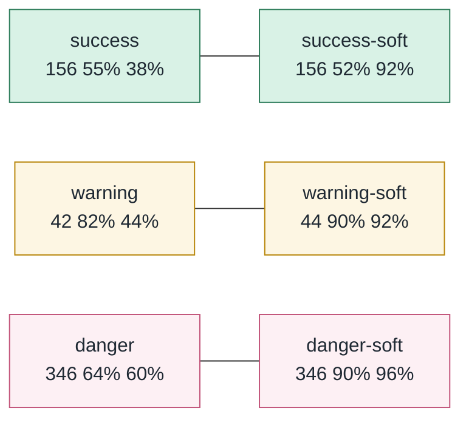
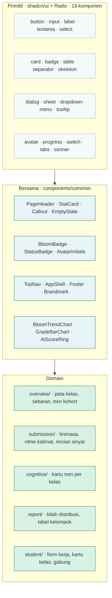
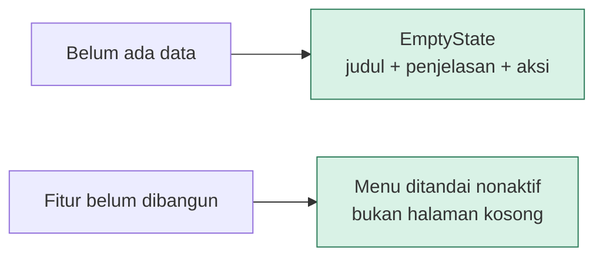

# 06 · Design System

Seluruh token di berkas ini diambil dari `frontend/app/globals.css` dan
`frontend/tailwind.config.ts`. Bila keduanya berubah, berkas ini harus menyusul.

---

## 6.1 Palet warna

Warna disimpan sebagai variabel CSS bernilai HSL tanpa pembungkus, sehingga
Tailwind bisa menambahkan alpha sendiri lewat `hsl(var(--token) / 0.5)`.

### Token merek

| Token | HSL | Peran |
|---|---|---|
| `--brand-teal` | `178 90% 38%` | Warna utama, aksi, garis grafik |
| `--brand-teal-light` | `173 68% 61%` | Gradasi dan aksen kedua |
| `--brand-mint` | `161 66% 81%` | Latar sekunder, sorotan lembut |
| `--brand-pink` | `340 100% 96%` | Latar avatar |

### Token semantik

| Token | HSL | Peran |
|---|---|---|
| `--background` | `164 36% 96%` | Latar halaman |
| `--foreground` | `176 51% 12%` | Teks utama |
| `--card` | `0 0% 100%` | Permukaan kartu |
| `--primary` | `178 90% 38%` | Tombol utama, tautan |
| `--secondary` | `161 66% 81%` | Lencana, sorotan |
| `--muted` | `164 40% 94%` | Latar tenang |
| `--muted-foreground` | `169 11% 40%` | Teks penjelas |
| `--border` / `--input` | `160 27% 89%` | Garis pemisah dan tepi isian |
| `--ring` | `178 90% 38%` | Cincin fokus |

### Token status

**Aturan pemakaian warna status.** Warna menandai **tindakan yang perlu diambil**,
bukan tingkat kecurigaan. Selisih Bloom yang tertinggal memakai `warning` karena
ia temuan terukur; skor AI tinggi memakai `danger` hanya ketika bergabung dengan
ketertinggalan, karena sendirian ia masih dugaan.

---

## 6.2 Skala tipografi

| Kelas | Ukuran | Tinggi baris | Pemakaian |
|---|---|---|---|
| `text-display-1` | 2.5rem | 1.1 | Judul halaman depan |
| `text-display-2` | 1.875rem | 1.2 | Judul halaman dalam |
| `text-body-lg` | 1.0625rem | 1.65 | Paragraf penting |
| `text-body` | 0.9375rem | 1.6 | Teks umum |
| `text-body-sm` | 0.8125rem | 1.55 | Penjelasan, isi tabel |
| `text-caption` | 0.75rem | 1.4 | Keterangan, satuan |

Kelas tambahan `caption-eyebrow` dipakai sebagai label kecil di atas judul
kartu, selalu berpasangan dengan `text-primary`.

---

## 6.3 Bentuk dan kedalaman

| Token | Nilai | Pemakaian |
|---|---|---|
| `--radius` | `0.75rem` | Dasar; `rounded-lg`, `md`, `sm` diturunkan darinya |
| `rounded-card` | `1rem` | Kartu |
| `shadow-soft` | dua lapis, opasitas rendah | Kartu diam |
| `shadow-soft-lg` | lebih menyebar | Kartu saat disentuh kursor |

Bayangan sengaja sangat lembut. Antarmuka ini menampilkan bukti yang menyangkut
nama orang, dan bayangan tebal membuat setiap kartu terasa seperti peringatan.

---

## 6.4 Hierarki komponen

Komponen domain **tidak pernah** memanggil primitif Radix langsung untuk hal
yang sudah punya pembungkus bersama. Itu menjaga agar perubahan gaya cukup
dilakukan di satu tempat.

---

## 6.5 Pola visualisasi data

| Grafik | Bentuk | Dipakai di | Yang diwarnai |
|---|---|---|---|
| `AiBloomScatter` | Scatter empat kuadran | Overview | Tindakan yang perlu diambil |
| `BloomDistributionChart` | Histogram + garis target | Overview | Gradasi teal; di bawah target jadi `warning` |
| `CohortTrendChart` | Area + garis target berundak | Overview | Teal untuk kelas, `warning` untuk target |
| `BloomTrendChart` | Area + garis acuan | Profil kognitif, progres | Teal, gradasi id unik per instans |
| `GradeBarChart` | Batang | Beranda mahasiswa | Nilai tertinggi penuh, sisanya mint |
| `AiScoreRing` | Cincin SVG | Detail submission | Mengikuti band |
| Kurva pertumbuhan | Area SVG polos | Linimasa submission | Teal |
| Bilah ritme kalimat | Batang per kalimat | Teks jawaban | Teal seragam |

**Tiga aturan grafik yang tidak boleh dilanggar.**

Pertama, **id gradien SVG wajib unik per instans**. Satu halaman bisa memuat
beberapa grafik sejenis, dan id yang dipatok tetap membuat semuanya merujuk
gradien pertama. Ini pernah terjadi dan diperbaiki dengan `useId()`.

Kedua, **grafik lebar wajib bisa digulir di dalam wadahnya sendiri**. Badan
halaman tidak boleh ikut bergulir mendatar.

Ketiga, **warna tidak boleh menyiratkan klaim yang tidak dimiliki data**. Ritme
kalimat mewarnai panjang kalimat, bukan tingkat kecurigaan, karena tidak ada
satu kalimat pun yang terdeteksi AI.

---

## 6.6 Pola keadaan kosong dan menu nonaktif

Menu **Materi** dan **Jadwal** sengaja dibiarkan nonaktif karena membutuhkan
model backend yang belum ada. Menu yang bisa diklik tetapi tidak melakukan apa
pun lebih menyesatkan daripada menu yang jujur menyatakan dirinya belum jadi.

Prinsip yang sama berlaku pada lonceng notifikasi: ia pernah punya titik merah
yang berarti "ada notifikasi belum dibaca", padahal tombolnya tidak punya
penangan sama sekali. Titik itu dihapus bersama tombol aktifnya.

---

## 6.7 Bahasa antarmuka

| Konteks | Sapaan | Contoh |
|---|---|---|
| Layar dosen | formal, "Anda" | "Kelas yang Anda ampu" |
| Layar mahasiswa | akrab, "kamu" | "Perkembangan cara berpikirmu" |
| Keterangan batas | terus terang | "Bahan tinjau, bukan vonis" |

Komponen yang dipakai kedua peran, misalnya `ProfileSettings`, memilih sapaan
berdasarkan `profile.role`, bukan menduplikasi berkasnya.

**Setiap layar yang menampilkan dugaan wajib menyertakan batasnya.** Contoh yang
sudah terpasang: halaman laporan memuat kartu bertuliskan "Belum tervalidasi",
dan panel verifikasi menjelaskan mengapa kesimpulan sesi tidak mengubah skor.

---

## 6.8 Zona waktu tampilan

Seluruh waktu ditampilkan dalam satu zona tetap, bawaannya `Asia/Jakarta`, dan
dapat diganti lewat `NEXT_PUBLIC_DISPLAY_TIME_ZONE`.

Zona dipaku, bukan mengikuti peramban, supaya dosen dan mahasiswa membaca jam
yang **sama persis** ketika membicarakan satu submission. Membiarkannya mengikuti
mesin yang merender pernah membuat jam meleset tujuh jam di Vercel, dan untuk
produk ini akibatnya bukan kosmetik: pengumpulan pukul 02.37 akan tampil 19.37
dan terlihat wajar.
