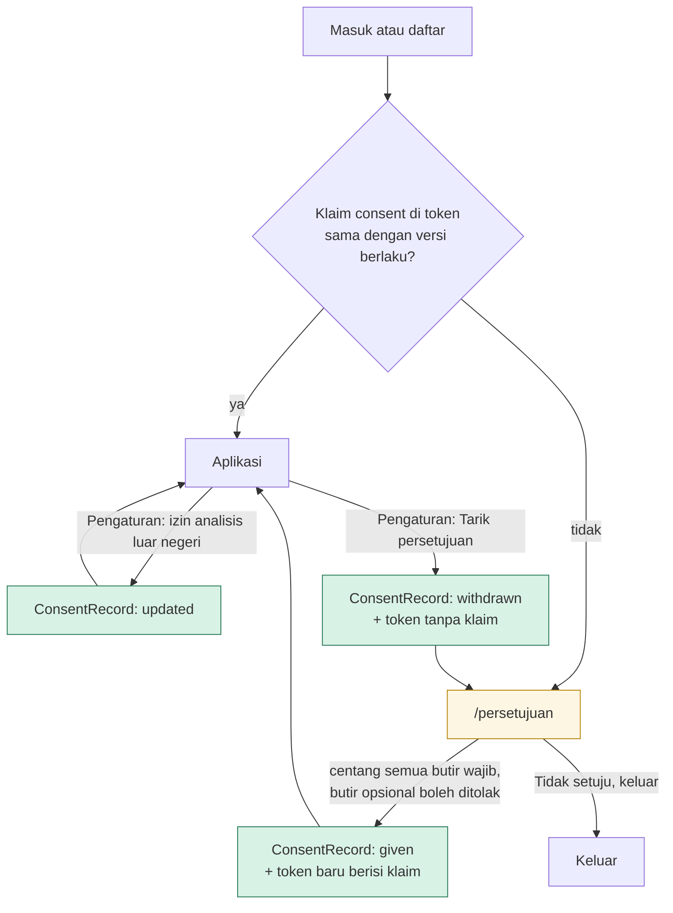
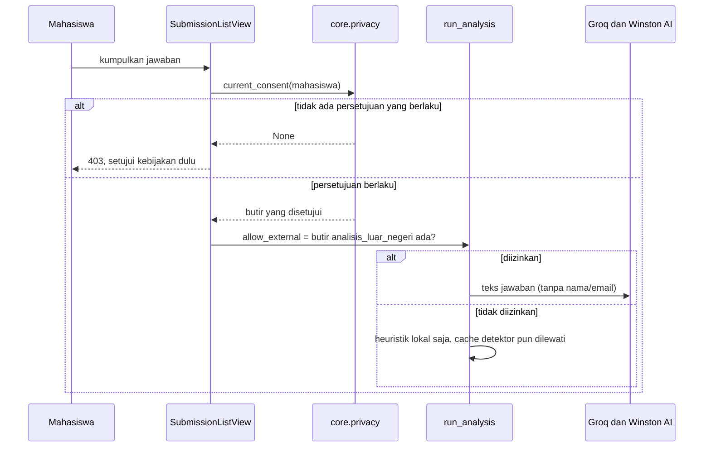

# 07 · Privasi dan Persetujuan

Berkas ini adalah jejak pertanggungjawaban halaman `/kebijakan-privasi`. Setiap
pernyataan di halaman itu dipetakan ke kode yang melaksanakannya dan ke pasal
yang mendasarinya, supaya isinya bisa diperiksa, bukan sekadar dipercaya.

Sumber hukum dibaca langsung dari teks resmi UU No. 27 Tahun 2022 tentang
Pelindungan Data Pribadi (UU PDP) di JDIH BPK, bukan dari ringkasan pihak ketiga.
Fakta penyedia layanan diambil dari dokumen resmi masing-masing penyedia, yang
dicantumkan di bagian 7.6.

Versi kebijakan yang dibahas: **2026-09-25**.

---

## 7.1 Alur persetujuan

Gerbang di layout membaca klaim `consent` dari token tanpa panggilan jaringan,
sama seperti klaim peran, supaya halaman tetap tampil seketika. Gerbang itu
hanya untuk tampilan. Pemrosesan data baru selalu diperiksa ke basis data
(bagian 7.2), karena token lama di perangkat lain masih memuat klaim
persetujuan setelah mahasiswa menariknya.

---

## 7.2 Penegakan di server

Analisis Ulang milik dosen melewati pemeriksaan yang sama terhadap persetujuan
mahasiswa pemilik jawaban, termasuk pilihan analisis luar negerinya.

---

## 7.3 Pemetaan pasal ke implementasi

| Pasal | Isi singkat | Implementasi | Berkas |
|---|---|---|---|
| 1 angka 1, 4, 5, 6 | Definisi data pribadi, pengendali, prosesor, subjek | Bagian 1 dan 2 kebijakan menyebut peran Tim DataDigger dan perguruan tinggi | `frontend/app/kebijakan-privasi/page.tsx` |
| 4 ayat (2), (3) | Data spesifik dan umum | Tabel data dan penegasan tidak meminta data spesifik | `page.tsx` bagian 3 |
| 5, 21 ayat (1) | Informasi yang wajib disampaikan | Bagian 3 sampai 9 kebijakan | `page.tsx` |
| 20 ayat (2) | Dasar pemrosesan | Tabel tujuan dan dasar | `page.tsx` bagian 5 |
| 21 ayat (2) | Perubahan diberitahukan sebelum terjadi | Versi kebijakan; persetujuan versi lama tidak berlaku sehingga layar persetujuan muncul lagi | `backend/core/privacy.py`, `frontend/lib/privacy.ts`, layout dosen dan mahasiswa |
| 22 ayat (1) sampai (3) | Persetujuan tertulis atau terekam, boleh elektronik | Model `ConsentRecord` | `backend/core/models.py` |
| 22 ayat (4), (5) | Tujuan lain harus dapat dibedakan, format mudah, bahasa sederhana | Butir terpisah per tujuan, tidak ada yang tercentang dari awal, butir wajib divalidasi server | `components/privacy/ConsentScreen.tsx`, `backend/core/serializers.py` |
| 24 | Bukti persetujuan wajib dapat ditunjukkan | Baris hanya ditambah, tidak pernah diubah; riwayat tampil di Pengaturan | `core/privacy.py` (`record_consent`), `components/settings/PrivacyPanel.tsx` |
| 25 | Data anak wajib persetujuan orang tua/wali | Butir `usia_atau_izin_wali` | `frontend/lib/privacy.ts` |
| 9, 40 | Penarikan persetujuan; pemrosesan berhenti paling lambat 3 × 24 jam | Endpoint tarik; pengumpulan dan analisis ulang memeriksa basis data, jadi berhenti seketika | `core/views.py` (`ConsentWithdrawView`), `academics/views.py` (`_require_student_consent`) |
| 10, 34 | Keberatan atas keputusan otomatis; penilaian dampak untuk penskoran sistematis | Tidak ada keputusan otomatis; hasil hanya bahan tinjau dosen; penilaian dampak awal di 7.4 | `page.tsx` bagian 6 |
| 7, 32 | Akses dan salinan beserta rekam jejak | `GET /api/me/consent` memuat riwayat; salinan lengkap lewat permohonan | `core/privacy.py` (`consent_status`) |
| 35 sampai 39 | Keamanan dan kerahasiaan | Hash kata sandi, JWT bertanda tangan, HTTPS dan HSTS, pemeriksaan kepemilikan, batas percobaan masuk | `backend/core`, `thinkpath/settings.py` |
| 46 | Pemberitahuan kegagalan pelindungan paling lambat 3 × 24 jam | Komitmen tertulis di kebijakan; belum ada otomasi | `page.tsx` bagian 10 |
| 56 ayat (4) | Transfer ke luar negeri atas persetujuan bila kesetaraan tidak terpenuhi | Butir `analisis_luar_negeri`; `run_analysis(allow_external=False)` melewati Groq, detektor, dan cache detektor | `academics/llm.py`, `academics/views.py` |

Versi kebijakan disimpan di dua tempat karena halaman kebijakan ada di frontend
dan bukti persetujuan dicatat backend. Tes
`core/tests/test_consent.py::PolicyVersionSyncTest` membaca `frontend/lib/privacy.ts`
dan gagal bila keduanya berbeda.

---

## 7.4 Penilaian dampak awal

Pasal 34 ayat (2) huruf d menggolongkan penskoran yang sistematis sebagai
pemrosesan berisiko tinggi. Tabel ini penilaian awal tim atas prototipe, bukan
penilaian dampak formal menurut peraturan pelaksananya. Perguruan tinggi yang
memakai ThinkPath secara resmi perlu melakukan penilaian dampaknya sendiri.

| Risiko | Akibat bagi mahasiswa | Mitigasi yang sudah berjalan | Sisa risiko dan tindak lanjut |
|---|---|---|---|
| Skor indikasi AI salah menuduh | Mahasiswa jujur dicurigai | Skor bukan vonis; tidak ada sanksi otomatis; kesimpulan sesi diskusi tidak memuat "terbukti menyontek"; hasil sesi tidak mengubah skor; dosen menyetujui tanggung jawabnya | ROC-AUC 0,900 diukur pada abstrak jurnal, bukan esai mahasiswa; ambang tinggi 70 belum terukur |
| Level Bloom keliru | Umpan balik perkembangan menyesatkan | Ditampilkan sebagai perkembangan, bukan nilai | Belum divalidasi penilai manusia |
| Transfer ke luar negeri | Data tunduk pada yurisdiksi lain | Hanya teks jawaban tanpa identitas; opsional dan bisa dicabut; hosting diungkapkan | Penilaian kesetaraan (Pasal 56 ayat (2)) dan perjanjian pemrosesan dengan penyedia belum ada |
| Token login dicuri lewat XSS | Akun diambil alih | SameSite=Lax, Secure, HTTPS | Cookie belum HttpOnly; rencana: sesi sisi server |
| Rasa diawasi saat menulis | Mahasiswa enggan menulis bebas | Hanya jumlah kata tiap 30 detik; tempelan dan ketikan tidak direkam; pemberitahuan di form | - |
| Data anak | Pemrosesan tanpa persetujuan wali | Butir usia wajib | Usia hanya pernyataan diri, tidak diverifikasi |
| Retensi tanpa batas | Data lama menumpuk | Penghapusan atas permintaan | Belum ada jadwal retensi otomatis |
| Teks tersimpan di Winston AI | Salinan jawaban di penyedia | Hanya bila diizinkan; laporan dapat dihapus | Penghapusan laporan masih manual |
| Akun demo publik | Data sungguhan masuk ke akun yang bisa dibuka siapa pun | Peringatan di kebijakan dan README | - |

---

## 7.5 Yang perlu dikonfirmasi tim sebelum rilis

- **Kontak permohonan.** Isi `NEXT_PUBLIC_PRIVACY_CONTACT_EMAIL` di Vercel. Tanpa
  itu kebijakan mengarahkan permohonan lewat dosen pengampu.
- **Region Supabase produksi.** Kebijakan menyebut Singapura berdasarkan host
  pooler `aws-1-ap-southeast-1` di `backend/.env.example`. Pastikan proyek
  produksi memang di region itu.
- **Zero Data Retention di Groq.** Tersedia di pengaturan Data Controls akun
  Groq; mengaktifkannya menghapus log 30 hari yang disebut kebijakan.
- **Penilaian kesetaraan dan perjanjian pemrosesan** dengan penyedia, bila
  ThinkPath dipakai resmi oleh perguruan tinggi.

---

## 7.6 Sumber

- UU No. 27 Tahun 2022 tentang Pelindungan Data Pribadi, JDIH BPK:
  https://peraturan.bpk.go.id/Details/229798/uu-no-27-tahun-2022
- UU No. 35 Tahun 2014 tentang Perubahan atas UU No. 23 Tahun 2002 tentang
  Perlindungan Anak, BPHN: https://bphn.go.id/data/documents/14uu035.pdf
- Groq, Your Data in GroqCloud: https://console.groq.com/docs/your-data
- Groq, Services Agreement (bagian 4.2 dan 11.5):
  https://console.groq.com/docs/legal/services-agreement
- Winston AI, Privacy Policy: https://gowinston.ai/privacy-policy/
- Supabase, Vercel, dan Hugging Face, kebijakan privasi masing-masing:
  https://supabase.com/privacy, https://vercel.com/legal/privacy-policy,
  https://huggingface.co/privacy
